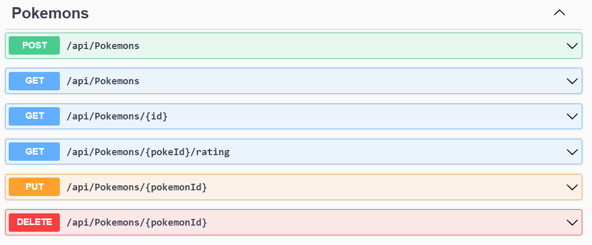
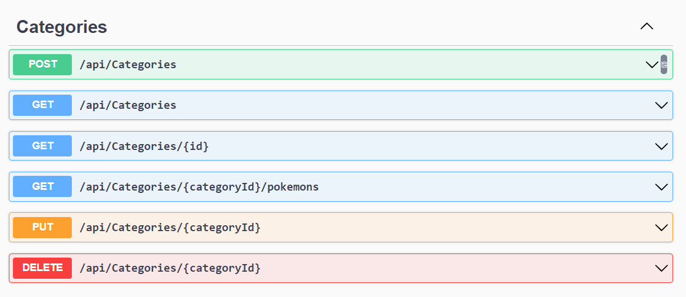
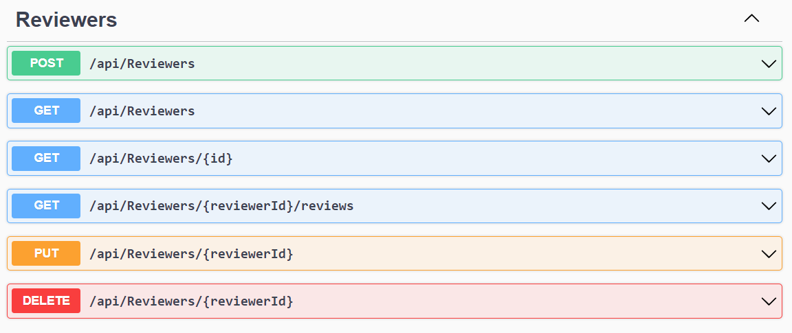
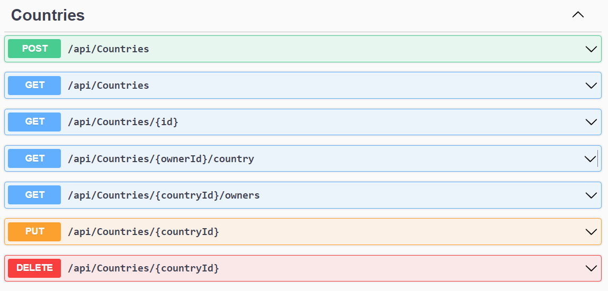
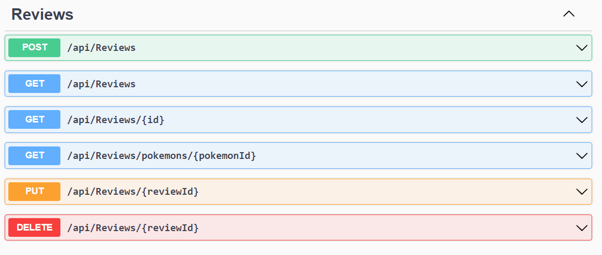

# Pokemon Review API

This project is an ASP.NET Core 6 Web API for reviewing Pokemons. It implements CRUD (Create, Read, Update, Delete) operations and follows best practices such as the Repository Pattern, Unit of Work, and uses AutoMapper for object-object mapping.

## Table of Contents

- [Pokemon Review API](#pokemon-review-api)
  - [Table of Contents](#table-of-contents)
  - [Features](#features)
  - [Technologies](#technologies)
  - [Getting Started](#getting-started)
    - [Prerequisites](#prerequisites)
    - [Installation](#installation)
  - [Project Structure](#project-structure)
  - [API Endpoints Screenshots](#api-endpoints-screenshots)
    - [Pokemons](#pokemons)
    - [Categories](#categories)
    - [Owners](#owners)
    - [Reviewers](#reviewers)
    - [Countries](#countries)
    - [Reviews](#reviews)
  - [License](#license)

## Features

- Create, Read, Update, Delete (CRUD) operations for Pokemon reviews.
- Implementation of Repository Pattern and Unit of Work.
- AutoMapper integration for mapping between domain models and DTOs.
- RESTful API design.

## Technologies

- .NET 6
- ASP.NET Core Web API
- AutoMapper
- Repository Pattern
- Unit of Work
- Entity Framework Core (EF Core)
- SQL Server (or any other supported database)

## Getting Started

### Prerequisites

- .NET 6 SDK
- SQL Server (or another supported database)
- Visual Studio 2022 (or another code editor)

### Installation

1. **Clone the repository:**

   ```sh
   git clone https://github.com/yourusername/pokemon-review-api.git
   cd pokemon-review-api
   ```

2. **Set up the database:**

   - Update the connection string in `appsettings.json` to point to your database.
   - Run the following command to apply migrations and create the database:
     ```sh
     dotnet ef database update
     ```

3. **Run the application:**
   ```sh
   dotnet run
   ```

## Project Structure

```
pokemon-review-api/
│
├── Bases/                # Base classes and interfaces
├── Configurations/       # Classes for Mapping Profile and Services Dependencies
├── Controllers/          # API Controllers
├── Data/                 # Database context and seed data
├── DTOs/                 # Data Transfer Objects (DTOs)
├── Helpers/              # Helper classes and utilities
├── Interfaces/           # Interface definitions for repositories and services
├── Migrations/           # Database migrations
├── Models/               # Domain models
├── Repositories/         # Repository implementations
├── appsettings.json      # Configuration file
├── Program.cs            # Application entry point
└── Startup.cs            # Configuration and middleware setup

```

## API Endpoints Screenshots

Here are some screenshots of the API in action:

### Pokemons



### Categories



### Owners


### Reviewers



### Countries



### Reviews



## License

This project is licensed under the MIT License - see the [LICENSE](LICENSE) file for details.
